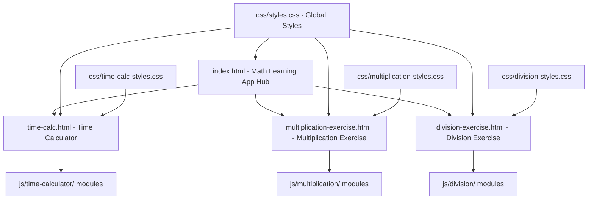
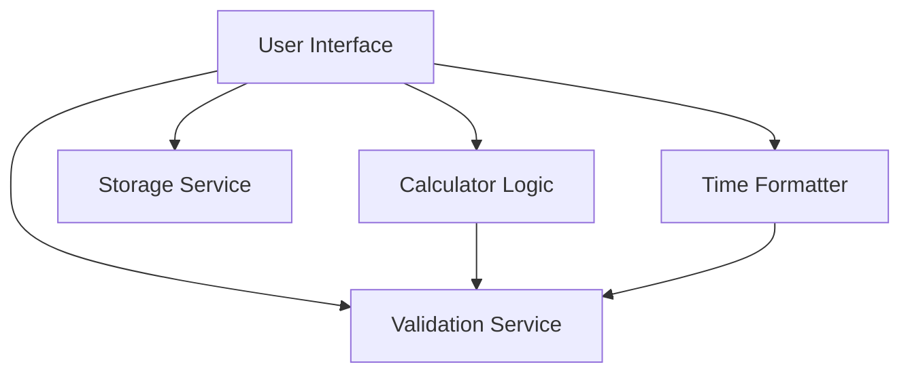
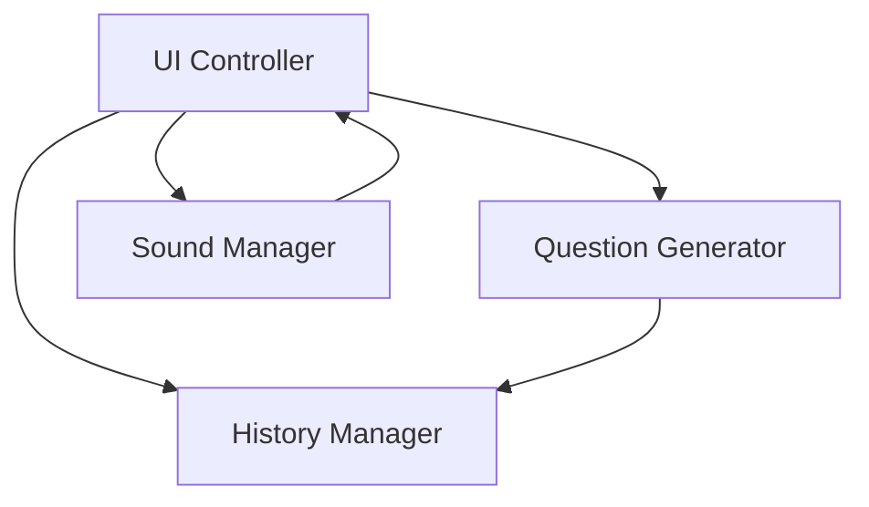

# System Patterns

## System Architecture
The application is now structured as a unified Math Learning App with three main features: the Time Calculator, the Integer Multiplication Exercise, and the Integer Division Exercise. The architecture follows a hub-and-spoke pattern with index.html as the central navigation hub and each feature as a separate, self-contained module.

### Overall Application Architecture

### Time Calculator Architecture

### Integer Multiplication Exercise Architecture

### Integer Division Exercise Architecture

## Key Technical Decisions
1. **Client-Side Processing**: All calculations are performed client-side using JavaScript to ensure quick response times and eliminate the need for server infrastructure.
2. **Modular Design**: The system is built with a modular approach to separate concerns and make the code maintainable.
3. **Time Representation**: Time is internally represented in seconds for all calculations to simplify operations, then converted to appropriate formats for display.
4. **Local Storage**: User calculation history is stored in the browser's local storage to enable persistence without requiring user accounts.
5. **Error Handling**: Comprehensive error handling is implemented for browser APIs and edge cases.
6. **Dependency Management**: Careful attention to avoid circular dependencies between modules.
7. **Feature Separation**: New features are implemented in separate directories with their own modules to maintain clean architecture.
8. **Sound Integration**: Sound effects are implemented to enhance user engagement, with controls to enable/disable them.
9. **Responsive Design**: All features are designed to work on various devices including phones and tablets.
10. **Code Reuse**: Similar components across features follow the same patterns to maximize code reuse and consistency.

## Design Patterns
1. **Module Pattern**: Each component is encapsulated in its own class to avoid polluting the global namespace.
2. **Strategy Pattern**: Different calculation operations (add, subtract, multiply, divide) are implemented as separate methods.
3. **Observer Pattern**: Event listeners are used to update the UI when user interactions occur.
4. **Factory Pattern**: The Storage class creates calculation objects with unique IDs and timestamps.
5. **Facade Pattern**: The UI class provides a simplified interface to the underlying components.
6. **Iterator Pattern**: Used in the exercise features to navigate through questions.
7. **Command Pattern**: Used for handling button clicks and user interactions in all features.
8. **Template Method Pattern**: Similar structures in Multiplication and Division exercises follow the same template with specific implementations.

## Component Relationships

### Time Calculator Components
1. **User Interface (UI)**:
   - Collects user inputs
   - Displays calculation results
   - Manages user interaction flow
   - Provides feedback for errors
   - Coordinates between other components

2. **Calculator Logic**:
   - Performs time calculations
   - Handles mathematical operations
   - Converts between time formats and seconds
   - Implements the four basic operations (add, subtract, multiply, divide)

3. **Formatter**:
   - Converts between different time formats
   - Handles display formatting with units
   - Provides child-friendly formatting with emojis
   - Formats calculation history for display

4. **Validator**:
   - Validates user inputs
   - Provides error messages
   - Ensures data integrity
   - Prevents extreme values that could cause performance issues

5. **Storage Service**:
   - Saves calculation history to local storage
   - Retrieves past calculations
   - Manages local storage with error handling
   - Provides graceful degradation when storage is unavailable

### Integer Multiplication Exercise Components
1. **UI Controller**:
   - Manages the user interface for the multiplication exercise
   - Handles DOM interactions and updates
   - Coordinates between other components
   - Displays questions and processes user answers
   - Manages navigation between questions
   - Shows results summary at the end of the exercise
   - Handles history visibility toggling

2. **Question Generator**:
   - Generates random 3-digit by 3-digit multiplication questions
   - Manages the current question set
   - Provides navigation between questions
   - Calculates answers
   - Tracks user answers and comparison results
   - Calculates score based on correct answers

3. **History Manager**:
   - Saves question history to local storage
   - Retrieves past questions
   - Formats timestamps for display
   - Handles storage errors and quota exceeded issues

4. **Sound Manager**:
   - Plays sound effects for user interactions
   - Manages sound preferences (on/off)
   - Handles browser audio API compatibility
   - Creates placeholder audio elements if needed

### Integer Division Exercise Components
1. **UI Controller**:
   - Manages the user interface for the division exercise
   - Handles DOM interactions and updates
   - Coordinates between other components
   - Displays questions and processes user answers
   - Manages navigation between questions
   - Shows results summary at the end of the exercise
   - Handles history visibility toggling

2. **Question Generator**:
   - Generates random 4-digit by 1-digit division questions
   - Ensures all division problems result in whole number answers
   - Manages the current question set
   - Provides navigation between questions
   - Calculates answers
   - Tracks user answers and comparison results
   - Calculates score based on correct answers

3. **History Manager**:
   - Saves question history to local storage
   - Retrieves past questions
   - Formats timestamps for display
   - Handles storage errors and quota exceeded issues

4. **Sound Manager**:
   - Plays sound effects for user interactions
   - Manages sound preferences (on/off)
   - Handles browser audio API compatibility
   - Reuses sound files from the multiplication exercise

## Critical Implementation Paths
1. **Time Parsing and Validation**:
   - Parse user input into standardized time format
   - Validate input for correctness and reasonable values
   - Convert to internal representation (seconds)
   - Provide user-friendly error messages

2. **Calculation Logic**:
   - Perform mathematical operations on time values
   - Handle edge cases (negative times, large values)
   - Ensure mathematical accuracy
   - Support multiple time formats

3. **Result Formatting**:
   - Convert calculation results to appropriate display format
   - Handle different time units (hours, minutes, seconds)
   - Format output for readability
   - Provide child-friendly formatting with emojis

4. **History Management**:
   - Save calculations to local storage with error handling
   - Retrieve and display calculation history
   - Allow reloading previous calculations
   - Support deleting individual or all history items

5. **Multiplication Question Generation**:
   - Generate random 3-digit numbers
   - Calculate multiplication results
   - Create question objects with unique IDs
   - Manage question set navigation

6. **Division Question Generation**:
   - Generate random 1-digit divisors (1-9)
   - Generate random 3-digit quotients
   - Calculate dividends by multiplying quotient and divisor
   - Ensure all division problems result in whole number answers
   - Create question objects with unique IDs
   - Manage question set navigation

7. **Sound Effect Integration**:
   - Load and play sound effects at appropriate times
   - Handle browser audio API limitations
   - Provide fallbacks when audio is not supported
   - Save user sound preferences

## Error Handling Approach
1. **Input Validation**:
   - Validate time formats using regular expressions
   - Check for extreme values that could cause performance issues
   - Provide clear, child-friendly error messages
   - Prevent invalid inputs in the exercise features

2. **Storage Error Handling**:
   - Check for local storage availability
   - Handle quota exceeded errors
   - Provide graceful degradation when storage is unavailable
   - Attempt to free up space when storage is full

3. **Calculation Error Handling**:
   - Prevent division by zero
   - Handle invalid number inputs
   - Manage negative time results appropriately
   - Handle potential overflow in large multiplication operations

## Feature Integration
1. **Navigation Between Features**:
   - Links between Time Calculator, Multiplication Exercise, and Division Exercise
   - Consistent UI elements across features
   - Shared styling patterns for cohesive experience

2. **Shared Resources**:
   - Common CSS variables for consistent styling
   - Similar error handling approaches
   - Consistent local storage management patterns
   - Shared sound effect files
