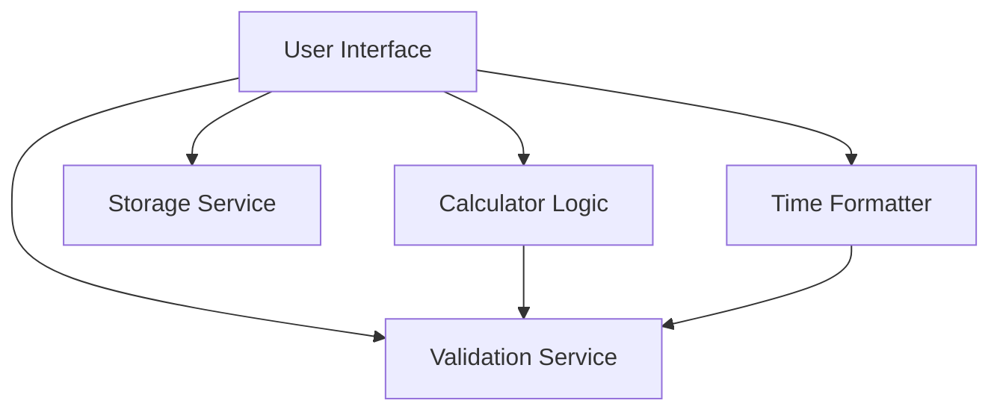

# System Patterns

## System Architecture
The Time Calculator follows a simple client-side architecture with the following components:

## Key Technical Decisions
1. **Client-Side Processing**: All calculations are performed client-side using JavaScript to ensure quick response times and eliminate the need for server infrastructure.
2. **Modular Design**: The system is built with a modular approach to separate concerns and make the code maintainable.
3. **Time Representation**: Time is internally represented in seconds for all calculations to simplify operations, then converted to appropriate formats for display.
4. **Local Storage**: User calculation history is stored in the browser's local storage to enable persistence without requiring user accounts.
5. **Error Handling**: Comprehensive error handling is implemented for browser APIs and edge cases.
6. **Dependency Management**: Careful attention to avoid circular dependencies between modules.

## Design Patterns
1. **Module Pattern**: Each component is encapsulated in its own class to avoid polluting the global namespace.
2. **Strategy Pattern**: Different calculation operations (add, subtract, multiply, divide) are implemented as separate methods.
3. **Observer Pattern**: Event listeners are used to update the UI when user interactions occur.
4. **Factory Pattern**: The Storage class creates calculation objects with unique IDs and timestamps.
5. **Facade Pattern**: The UI class provides a simplified interface to the underlying components.

## Component Relationships
1. **User Interface (UI)**:
   - Collects user inputs
   - Displays calculation results
   - Manages user interaction flow
   - Provides feedback for errors
   - Coordinates between other components

2. **Calculator Logic**:
   - Performs time calculations
   - Handles mathematical operations
   - Converts between time formats and seconds
   - Implements the four basic operations (add, subtract, multiply, divide)

3. **Formatter**:
   - Converts between different time formats
   - Handles display formatting with units
   - Provides child-friendly formatting with emojis
   - Formats calculation history for display

4. **Validator**:
   - Validates user inputs
   - Provides error messages
   - Ensures data integrity
   - Prevents extreme values that could cause performance issues

5. **Storage Service**:
   - Saves calculation history to local storage
   - Retrieves past calculations
   - Manages local storage with error handling
   - Provides graceful degradation when storage is unavailable

## Critical Implementation Paths
1. **Time Parsing and Validation**:
   - Parse user input into standardized time format
   - Validate input for correctness and reasonable values
   - Convert to internal representation (seconds)
   - Provide user-friendly error messages

2. **Calculation Logic**:
   - Perform mathematical operations on time values
   - Handle edge cases (negative times, large values)
   - Ensure mathematical accuracy
   - Support multiple time formats

3. **Result Formatting**:
   - Convert calculation results to appropriate display format
   - Handle different time units (hours, minutes, seconds)
   - Format output for readability
   - Provide child-friendly formatting with emojis

4. **History Management**:
   - Save calculations to local storage with error handling
   - Retrieve and display calculation history
   - Allow reloading previous calculations
   - Support deleting individual or all history items

## Error Handling Approach
1. **Input Validation**:
   - Validate time formats using regular expressions
   - Check for extreme values that could cause performance issues
   - Provide clear, child-friendly error messages

2. **Storage Error Handling**:
   - Check for local storage availability
   - Handle quota exceeded errors
   - Provide graceful degradation when storage is unavailable
   - Attempt to free up space when storage is full

3. **Calculation Error Handling**:
   - Prevent division by zero
   - Handle invalid number inputs
   - Manage negative time results appropriately
